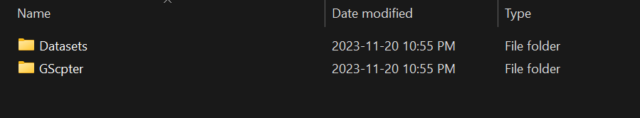

```{r setup, include=FALSE}
knitr::opts_chunk$set(echo = TRUE)
```

# Getting Started

## Set up Rstudio

-   Download and install [R](https://cran.rstudio.com/) and [Rstudio](https://posit.co/download/rstudio-desktop/).

## Set up GScpter

1.  Download GScpter version 1.0.0 (v1.0.0) from [Github](https://github.com/NewtontheNeuron/GScpter/releases/tag/v1.0.0) by clicking on GScpter.zip.
2.  Extract the folder and save it in a convenient location on your computer. All of your outputs will be stored there.
3.  In the same location as the GScpter folder create a folder called "Datasets". All of your datasets (fully clustered single cell RNA seq data) should be stored there.
4.  Download your datasets and save them in the "Datasets" folder. See the bellow example. 

## Understand Rstudio first

You will need to have basic understanding of Rstudio first. You can watch a youtube video to get the gist of it.

# Data Analysis {.tabset .tabset-fade .tabset-pills}

Choose to either analyze the mouse dataset from [Russ et al. (2021)](https://www.nature.com/articles/s41467-021-25125-1) or the human dataset from [Yadav et al. (2023)](https://www.cell.com/neuron/pdfExtended/S0896-6273(23)00031-4).

## Mouse🐭

### Mouse data analysis: Russ et al. (2021)

1.  Open Rstudio
2.  Open the following file `GScpter/Data/JSON/russ_2021_mouse_SDH_DDH_template.json`
3.  Take note of line 2 in second file: `"features" : ["rna_Grin1", "rna_Grin2a", "rna_Grin2b, ...]`
    -   Features is the list of gene targets
    -   All gene targets must be placed within the brackets associated with the `"features"` tag, i.e. `"features" : [...]`.
    -   All genes must be surrounded by quotation marks (`""`).
    -   All genes must be accompanied by a prefix (`rna_`).
    -   All genes must be separated by a comma like this: `"rna_Grin1", "rna_Grin2a"`
4.  Change the genes to your target genes

Before:

```{JSON}
"features" : ["rna_Grin1", "rna_Grin2a", "rna_Grin2b", "rna_Grin2c"]
```

After:

```{JSON}
"features" : ["rna_Cnr1", "rna_Cnr2", "rna_Ptpn5", "rna_Ntrk2"]
```

5.  Remove the genes you do not need

Before:

```{JSON}
"features" : ["rna_Grin1", "rna_Grin2a", "rna_Grin2b", "rna_Grin2c"]
```

After:

```{JSON}
"features" : ["rna_Grin1", "rna_Grin2a", "rna_Grin2b"]
```

6.  Add the genes that you need by separating them with a comma

Before:

```{JSON}
"features" : ["rna_Grin1", "rna_Grin2a", "rna_Grin2b", "rna_Grin2c"]
```

After:

```{JSON}
"features" : ["rna_Grin1", "rna_Grin2a", "rna_Grin2b", "rna_Grin2c", "rna_Cnr1"]
```

7.  Afterward, take note of line 3. Change the `"project_name"` value to something that is recognizable. It is not necessary to change it. If you are OK with overwriting the files after each run then leave it as is.

Before:

```{JSON}
"project_name" : "mouse",
```

After:

```{JSON}
"project_name" : "mouse_Jan_5_2024",
```

8.  Once you finish adjusting the target gene list and project name, save the file by selecting `File > Save` or using `Ctrl+S` or `Cmd+S`.
9.  Open the following file in Rstudio `GScpter/Scripts/main_russ2021.R`
10. Then in the navigation bar click on `Code > Run Region > Run All`. The run may take a while depending mostly on the amount of RAM available in your computer.
11. Your Outputs should be stored in `GScpter/Output/[project_name]`.
12. If you need the change the width of the graphs then there is a list (`runwidth`) of all the widths in pixels on line 3 of `GScpter/Scripts/main_russ2021.R`. Each item in the list corresponds to output graphs in order. The order is full dot plot, then the full dot plot without all labels, the full dot plot without x labels, pooled dot plot, pooled dot plot without x labels. Simply change the number and repeat steps 10 and 11. You can repeat it until you get the ideal size.
13. For publications, the height must be the same across all of the graphs. However, you may change the height on line 4 as `runheight`.

## Human🧑👩

### Human data analysis: Yadav et al. (2021)

1.  Open Rstudio
2.  Open the following file `GScpter/Data/JSON/yadav_2023_human_DH_template.json`
3.  Take note of line 2 in second file: `"features" : ["rna_GRIN1", "rna_GRIN2A", "rna_GRIN2B, ...]`
    -   Human genes are written in all caps
    -   Features is the list of gene targets
    -   All gene targets must be placed within the brackets associated with the `"features"` tag, i.e. `"features" : [...]`.
    -   All genes must be surrounded by quotation marks (`""`).
    -   All genes must be accompanied by a prefix (`rna_`).
    -   All genes must be separated by a comma like this: `"rna_GRIN1", "rna_GRIN2A"`
4.  Change the genes to your target genes

Before:

```{JSON}
"features" : ["rna_GRIN1", "rna_GRIN2A", "rna_GRIN2B", "rna_GRIN2C"]
```

After:

```{JSON}
"features" : ["rna_CNR1", "rna_CNR2", "rna_PTPN5", "rna_NTRK2"]
```

5.  Remove the genes you do not need

Before:

```{JSON}
"features" : ["rna_GRIN1", "rna_GRIN2A", "rna_GRIN2B", "rna_GRIN2C"]
```

After:

```{JSON}
"features" : ["rna_GRIN1", "rna_GRIN2A", "rna_GRIN2B"]
```

6.  Add the genes that you need by separating them with a comma

Before:

```{JSON}
"features" : ["rna_GRIN1", "rna_GRIN2A", "rna_GRIN2B", "rna_GRIN2C"]
```

After:

```{JSON}
"features" : ["rna_GRIN1", "rna_GRIN2A", "rna_GRIN2B", "rna_GRIN2C", "rna_CNR1"]
```

7.  Afterward, take note of line 3. Change the `"project_name"` value to something that is recognizable. It is not necessary to change it. If you are OK with overwriting the files after each run then leave it as is.

Before:

```{JSON}
"project_name" : "human",
```

After:

```{JSON}
"project_name" : "human_Jan_5_2024",
```

8.  Once you finish adjusting the target gene list and project name, save the file by selecting `File > Save` or using `Ctrl+S` or `Cmd+S`.
9.  Open the following file in Rstudio `GScpter/Scripts/main_yadav2023.R`
10. Then in the navigation bar click on `Code > Run Region > Run All`. The run may take a while depending mostly on the amount of RAM available in your computer.
11. Your Outputs should be stored in `GScpter/Output/[project_name]`.
12. If you need the change the width of the graphs then there is a list (`runwidth`) of all the widths in pixels on line 3 of `GScpter/Scripts/main_yadav2023.R`. Each number in the list corresponds to output graphs in order. The order is full dot plot, then the full dot plot without all labels, the full dot plot without x labels, pooled dot plot, pooled dot plot without x labels. Simply change the number and repeat steps 10 and 11. You can repeat it until you get the ideal size.
13. For publications, the height must be the same across all of the graphs. However, you may change the height on line 4 as `runheight`.

# Conclusion

Thank you for reading. Feel free to send an email to `newtonmartin@cmail.carleton.ca` if you encounter any issues.
